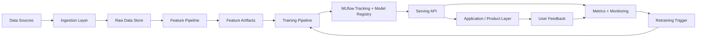

# Production AI/ML Platform

A fully integrated, production-grade machine learning platform covering the entire lifecycle: data ingestion → feature engineering → distributed training → model serving → monitoring → automated retraining.

## Architecture Overview

```
┌─────────────────────────────────────────────────────────┐
│  INGEST   Kafka · Batch ETL · REST APIs · Unstructured  │
├─────────────────────────────────────────────────────────┤
│  STORE    Data Lake · Feature Store · Vector DB          │
├─────────────────────────────────────────────────────────┤
│  TRAIN    Distributed PyTorch · MLflow · HPO · Registry  │
├─────────────────────────────────────────────────────────┤
│  SERVE    Online API · RAG Pipeline · Batch Inference    │
├─────────────────────────────────────────────────────────┤
│  OBSERVE  Drift · Latency · RLHF · Auto-retrain loop    │
└─────────────────────────────────────────────────────────┘
```
# Production-Style AI/ML Platform for Ingestion, Feature Engineering, Training, Serving, and Monitoring

[](https://github.com/TagoreNand/aiml-data-ingest-feature-engineering/actions/workflows/ci.yml)
[](https://www.python.org/)
[](https://fastapi.tiangolo.com/)
[](https://pytorch.org/)
[](https://mlflow.org/)
[](./LICENSE)

A production-style AI/ML engineering project that simulates how a senior ML engineer would build and operate an end-to-end platform across the full lifecycle:

**multi-source ingestion → feature engineering → model training → model registry → online serving → monitoring → retraining triggers**

This repository is designed to showcase **backend engineering, MLOps thinking, model lifecycle management, and AI product integration** in one cohesive system rather than presenting isolated notebooks or toy scripts.

---

## Why this project stands out

Most portfolio projects stop at training a model. This one is structured like a real platform:

- **Multiple ingestion patterns**: batch, Kafka, and REST API ingestion
- **Feature pipeline**: validation, transformation, split generation, and Parquet materialization
- **Training workflow**: Hugging Face + PyTorch training with experiment tracking
- **Model lifecycle management**: MLflow-backed registration and champion/challenger promotion flow
- **Serving layer**: FastAPI inference API with health, metrics, and feedback endpoints
- **Monitoring**: latency/error tracking, drift detection, and retraining triggers
- **RAG support**: FAISS-backed retrieval pipeline with LLM generation support
- **Engineering maturity**: Docker, structured logging, tests, and GitHub Actions CI/CD

---

## What this project demonstrates

### ML Engineering
- Feature engineering and dataset preparation pipelines
- Model training and evaluation workflows
- Hyperparameter optimization with Optuna
- Transformer-based NLP model integration using Hugging Face

### MLOps / Platform Engineering
- Config-driven pipeline design
- Model versioning and registry-based promotion
- Observability with Prometheus-style metrics and drift checks
- CI/CD automation for linting, tests, and image builds
- Containerized deployment with Docker

### Product / API Thinking
- Online prediction endpoints for product integration
- Feedback capture for improving future model versions
- Retrieval-augmented generation support for knowledge-enabled features
- Operational endpoints for health and metrics in production-style environments

---

## High-level architecture



---

## Core capabilities

### 1) Data ingestion
The ingestion layer supports different modes of bringing data into the platform:

- **Batch ingestion** for CSV/Parquet-based ETL workloads
- **Kafka ingestion** for event-driven streaming scenarios
- **API ingestion** for pulling paginated data from REST services with retry logic and rate limiting

All ingestors normalize records into a common schema and persist raw events to the landing zone.

### 2) Feature engineering
The feature pipeline is designed as a reusable transformation layer that:

- validates incoming raw data
- removes duplicates / empty rows
- creates text-based features such as length and word count
- extracts time-based features from datetime columns
- splits data into train / validation / test datasets
- materializes outputs to Parquet for downstream training

### 3) Training and experimentation
The training workflow supports:

- transformer-based model loading
- configurable hyperparameters
- experiment tracking through MLflow
- optional Optuna-based HPO
- evaluation against validation / test data
- registry-based model registration after training

### 4) Model registry and promotion
The registry layer follows a practical **champion/challenger** approach:

- newly trained models are registered as versions
- promotion only happens if metrics meet configured thresholds
- the current champion can be replaced automatically when a stronger version is produced

This mirrors how production ML teams reduce deployment risk.

### 5) Serving and API integration
The serving layer exposes operational and inference endpoints through FastAPI:

- `/health` for service health checks
- `/metrics` for observability
- `/predict` for online inference
- `/feedback` for collecting user-corrected outcomes

This makes the project integration-ready for real applications.

### 6) Monitoring and retraining
The monitoring layer tracks:

- rolling latency and error metrics
- dataset drift using Evidently with PSI fallback
- retraining decisions based on drift thresholds or feedback volume

This shows not just how to deploy a model, but how to **operate it responsibly over time**.

### 7) Retrieval-Augmented Generation
The repository also includes a RAG pipeline that:

- embeds documents with sentence transformers
- stores vectors in a FAISS index
- retrieves top-k relevant chunks
- builds grounded prompts for LLM-based answers

This makes the platform extensible beyond standard supervised ML.

---

## Repository structure

```text
aiml-data-ingest-feature-engineering/
├── .github/workflows/      # CI/CD workflow definitions
├── configs/                # Example config + monitoring config
├── data/
│   ├── raw/                # Ingested landing-zone data
│   ├── processed/          # Cleaned / reference / batch artifacts
│   └── features/           # Train / val / test feature outputs
├── docs/                   # Architecture and runbooks
├── logs/                   # Runtime logs, drift reports, retraining triggers
├── models/                 # Model artifacts / FAISS index / ML artifacts
├── notebooks/              # Exploratory work and experimentation
├── scripts/                # CLI entry points for running platform workflows
├── src/
│   ├── ingestion/          # Batch / Kafka / API ingestors
│   ├── features/           # Feature transformation pipeline
│   ├── training/           # Trainer, registry, HPO, model builders
│   ├── serving/            # FastAPI API + RAG pipeline
│   ├── monitoring/         # Metrics, drift, retraining trigger logic
│   └── utils/              # Config loader, schemas, logger
├── tests/
│   ├── unit/               # Feature and monitoring unit tests
│   └── integration/        # API integration tests
├── Dockerfile
├── docker-compose.yml
├── pyproject.toml
├── requirements.txt
└── README.md
```

---

## Tech stack

| Layer | Technologies |
|---|---|
| Language | Python 3.11 |
| Ingestion | Pandas, Requests, Kafka |
| Feature Engineering | Pandas, NumPy, scikit-learn, PyArrow |
| Training | PyTorch, Transformers, Datasets |
| Experiment Tracking | MLflow |
| Hyperparameter Optimization | Optuna |
| Serving | FastAPI, Uvicorn |
| Monitoring | Evidently, Prometheus client |
| RAG / Search | FAISS, sentence-transformers, OpenAI |
| DevEx / CLI | Typer, Rich, Loguru |
| Infra | Docker, GitHub Actions |

---

## Quick start

### 1. Clone the repository
```bash
git clone https://github.com/TagoreNand/aiml-data-ingest-feature-engineering.git
cd aiml-data-ingest-feature-engineering
```

### 2. Create and activate a virtual environment
```bash
python -m venv .venv
source .venv/bin/activate
```

On Windows PowerShell:
```powershell
python -m venv .venv
.venv\Scripts\Activate.ps1
```

### 3. Install dependencies
```bash
pip install -r requirements.txt
```

### 4. Create your runtime config
```bash
cp configs/config.example.yaml configs/config.yaml
```

Fill in any values required for your environment.

---

## End-to-end workflow

### Run ingestion
```bash
python scripts/run_ingestion.py batch --config configs/config.yaml
```

### Build features
```bash
python scripts/build_features.py --config configs/config.yaml
```

### Train a model
```bash
python scripts/train.py --experiment baseline_run --config configs/config.yaml
```

### Run HPO
```bash
python scripts/train.py --experiment hpo_run --run-hpo --config configs/config.yaml
```

### Evaluate a registered model
```bash
python scripts/evaluate.py --version champion --config configs/config.yaml
```

### Start the API
```bash
uvicorn src.serving.api:app --host 0.0.0.0 --port 8000
```

### Run drift monitoring
```bash
python scripts/run_monitoring.py data/processed/reference_dataset.parquet --config configs/config.yaml
```

---

## API overview

### Health check
```http
GET /health
```

### Metrics
```http
GET /metrics
```

### Prediction
```http
POST /predict
Content-Type: application/json

{
  "inputs": ["hello world", "another sample"],
  "model_version": "champion"
}
```

### Feedback
```http
POST /feedback
Content-Type: application/json

{
  "prediction_id": "abc-123",
  "true_label": 1,
  "predicted_label": 0,
  "source": "web-app"
}
```

---

## Testing

Run all tests:
```bash
pytest tests/ -v --cov=src --cov-report=html
```

Run only unit tests:
```bash
pytest tests/unit/ -v
```

Run only integration tests:
```bash
pytest tests/integration/ -v
```

This repository includes:

- unit tests for feature engineering and monitoring behavior
- integration tests for the FastAPI serving layer
- CI workflow for linting, type checks, test execution, and image builds

---

## Docker

Build the image:
```bash
docker build -t aiml-platform .
```

Run the API container:
```bash
docker run -p 8000:8000 aiml-platform
```

---

## Engineering design choices

### Config-first architecture
Runtime behavior is controlled through YAML configuration so the same codebase can support development, staging, and production patterns with minimal code changes.

### Separation of concerns
Each layer of the platform is isolated into its own package:
- ingestion
- features
- training
- serving
- monitoring
- utils

This makes the project easier to scale, test, and reason about.

### Production-style observability
The platform includes:
- structured logging
- latency/error metrics
- health endpoints
- drift reports
- retraining triggers

### Portfolio positioning
This project is intentionally built to reflect the responsibilities of a **AI/ML engineer**, including:
- platform ownership
- system design
- ML lifecycle thinking
- deployment readiness
- monitoring and feedback loops
- collaboration between data, product, and platform concerns

---

## Documentation

Additional design notes and runbooks are available in:

```text
docs/architecture.md
```

---

## Project summary

> Built a production-style AI/ML platform supporting multi-source ingestion, feature engineering, transformer training, MLflow model registry, FastAPI serving, drift monitoring, and retraining triggers. Designed the system with modular pipelines, CI/CD automation, Dockerized deployment, and RAG extensibility to reflect real-world senior ML engineering responsibilities.

---

## Future improvements

- Add real cloud object storage integration for batch ingestion
- Add distributed training execution with Ray or multi-GPU workers
- Expand deployment workflow from placeholders to real cluster rollout
- Add dashboarding for metrics and drift visualization
- Add feature store materialization to a live online store
- Add authentication / rate limiting to serving endpoints

---

## License

MIT

