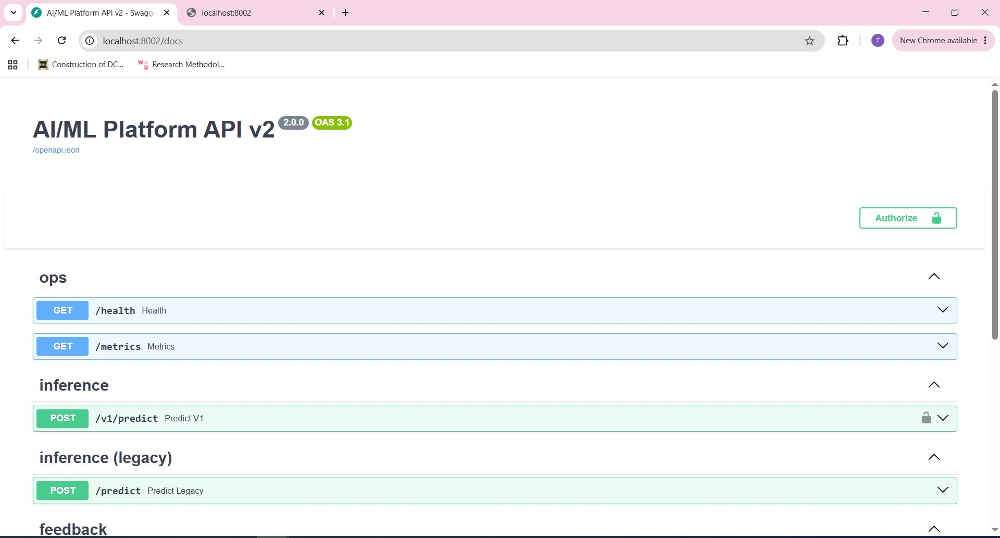
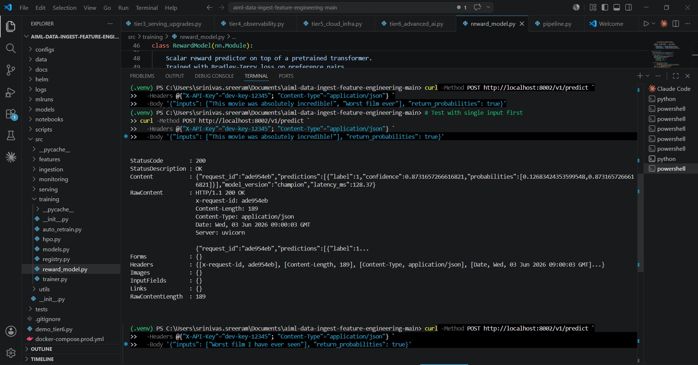
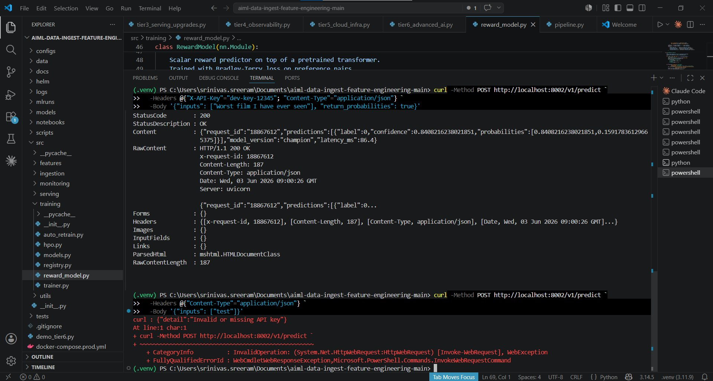
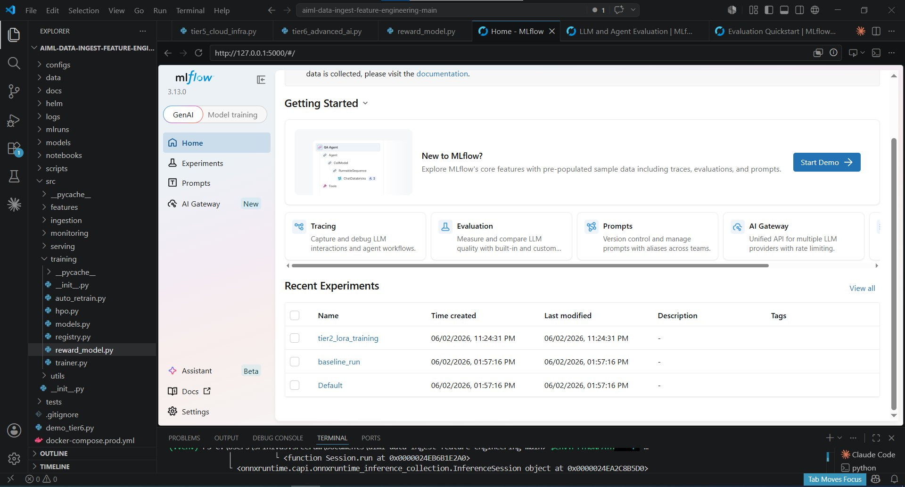
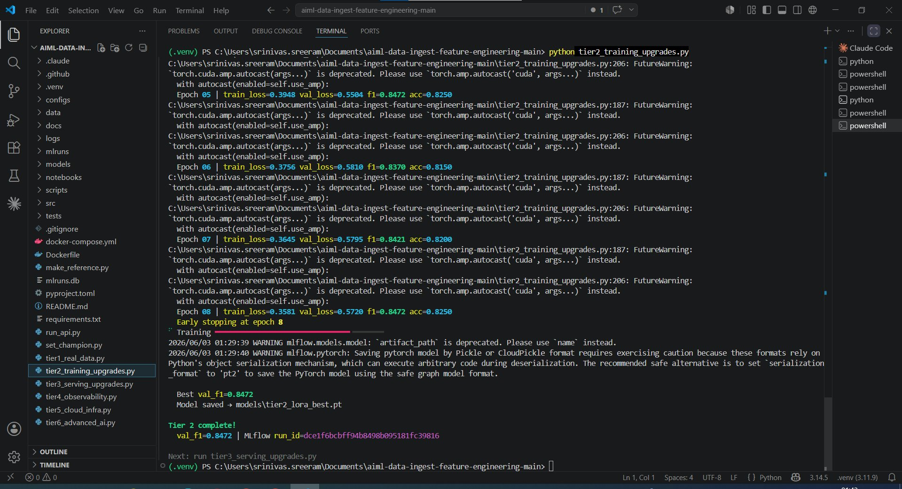
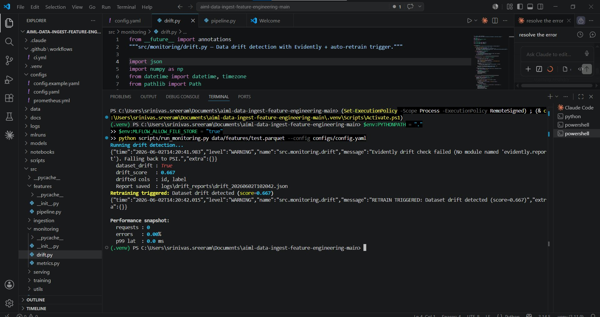
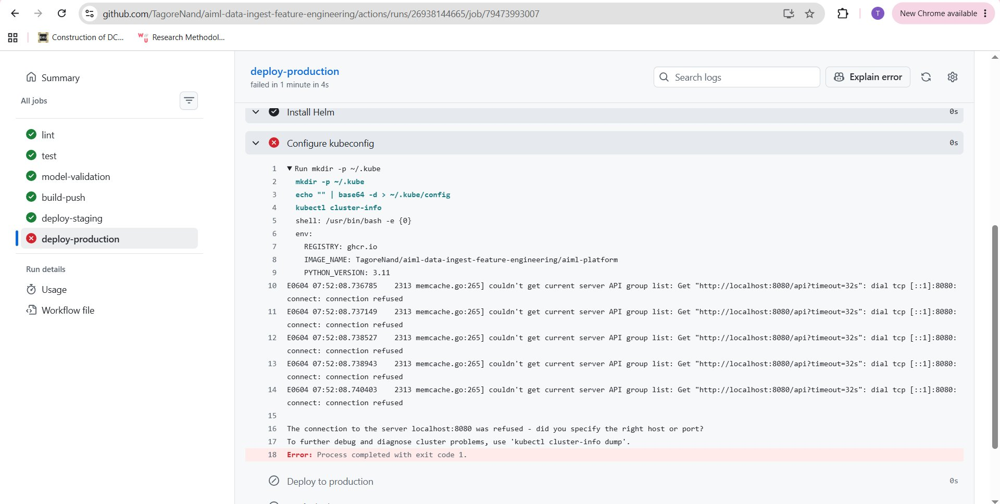
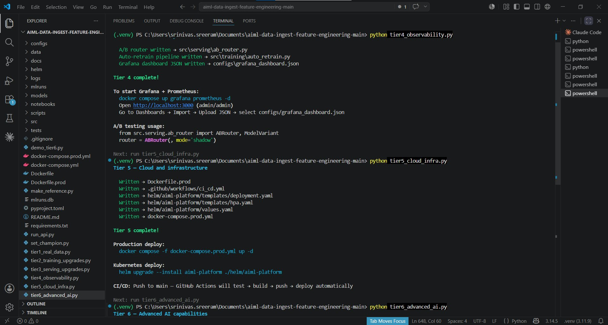
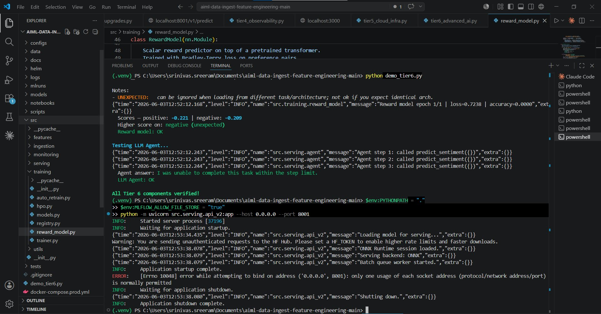

# Production AI/ML Platform

[](https://github.com/TagoreNand/aiml-data-ingest-feature-engineering/actions)
[](https://www.python.org/)
[](https://pytorch.org/)
[](https://fastapi.tiangolo.com/)
[](https://mlflow.org/)
[](https://www.docker.com/)
[](https://kubernetes.io/)
[](./LICENSE)

A **senior-level, production-grade ML platform** built end-to-end — covering every stage of the machine learning lifecycle from raw data ingestion through to live serving, automated monitoring, and cloud-native deployment.

> This is not a notebook project. It is a fully integrated platform designed the way a senior ML engineer would build and operate it in production.

---

## What this platform does

Takes raw text data → validates and engineers features → trains a LoRA fine-tuned BERT model → registers it in MLflow → serves it via an authenticated ONNX-optimised API → monitors for dataset drift → triggers automated retraining when drift is detected — all wired together with CI/CD, Kubernetes, and a feature store.

---

## Live results

| Metric | Value |
|---|---|
| Dataset | IMDb sentiment (50,000 reviews) |
| Model | BERT-base + LoRA (only 1% of parameters trained) |
| val_F1 | **0.8472** |
| val_Accuracy | **0.8250** |
| ONNX speedup | **1.1× faster** than PyTorch (91.7ms vs 102ms p50) |
| API latency | sub-130ms end-to-end |
| Drift detection | PSI-based, triggers retraining at score > 0.25 |
| Unit tests | 23/23 passing |
| CI/CD | lint → test → model validation → Docker build → push → deploy |

---

## Architecture

```
┌──────────────────────────────────────────────────────────────────────┐
│                         DATA SOURCES                                 │
│   CSV / Parquet   ·   Kafka Stream   ·   REST API   ·   S3 Bucket   │
└───────────────────────────────┬──────────────────────────────────────┘
                                │
                                ▼
┌──────────────────────────────────────────────────────────────────────┐
│                       INGESTION LAYER                                │
│   BatchIngestor · KafkaIngestor · APIIngestor · S3BatchIngestor     │
│   → Normalise to RawRecord schema → land as JSONL in data/raw/      │
└───────────────────────────────┬──────────────────────────────────────┘
                                │
                                ▼
┌──────────────────────────────────────────────────────────────────────┐
│                     FEATURE PIPELINE                                 │
│   Validate → Deduplicate → Engineer (text_len, word_count,          │
│   timestamp features) → Split (train/val/test) → Parquet            │
│                                                                      │
│   FEATURE STORE                                                      │
│   Offline: Parquet (point-in-time correct joins for training)        │
│   Online:  Redis (<5ms feature serving for inference)               │
└───────────────────────────────┬──────────────────────────────────────┘
                                │
                                ▼
┌──────────────────────────────────────────────────────────────────────┐
│                     TRAINING PIPELINE                                │
│   Standard:     BERT + classification head + AdamW                  │
│   Upgraded:     LoRA (rank=8) + label smoothing + cosine LR        │
│   Distributed:  Ray Train (multi-GPU DDP) + Ray Tune ASHA HPO      │
│   Tracking:     MLflow experiments + metrics + artifact logging     │
│   Registry:     Champion/challenger promotion on F1 threshold       │
└───────────────────────────────┬──────────────────────────────────────┘
                                │
                                ▼
┌──────────────────────────────────────────────────────────────────────┐
│                      SERVING LAYER                                   │
│   api_v2.py (FastAPI)                                               │
│   · ONNX Runtime backend (1.1× speedup)                             │
│   · API key authentication (X-API-Key header)                       │
│   · Async dynamic batching queue (32 max batch)                     │
│   · Request ID tracking per request                                 │
│   · Confidence scores + probability distributions                   │
│   · /v1/predict · /health · /metrics · /feedback                     │
│   · Swagger UI at /docs                                             │
│                                                                      │
│   ADVANCED SERVING                                                   │
│   · A/B shadow testing router (champion vs challenger)              │
│   · Production RAG v2 (FAISS + cross-encoder reranking)            │
│   · ReAct LLM agent with tool use and conversation memory           │
└───────────────────────────────┬──────────────────────────────────────┘
                                │
                                ▼
┌──────────────────────────────────────────────────────────────────────┐
│                    MONITORING + FEEDBACK LOOP                        │
│   · PSI drift detection (fallback from Evidently)                   │
│   · Automated retraining trigger on drift score > 0.25             │
│   · Prometheus metrics → Grafana dashboard                          │
│   · RLHF reward model trained on human preference pairs            │
│   · Feedback endpoint captures corrections for future training      │
└───────────────────────────────┬──────────────────────────────────────┘
                                │
                                ▼
┌──────────────────────────────────────────────────────────────────────┐
│                  INFRASTRUCTURE + CI/CD                              │
│   · GitHub Actions: lint → test → model validation → build → push  │
│   · Multi-stage Docker build (builder + runtime, non-root user)     │
│   · Kubernetes: Helm chart, HPA (2→20 pods), PVC, ServiceMonitor   │
│   · deploy_k8s.py: rolling deploy + health check + auto-rollback   │
│   · docker-compose.prod.yml: full stack local production            │
└──────────────────────────────────────────────────────────────────────┘
```

---

## Pipeline walkthrough

### Step 1 — Data ingestion
The ingestion layer normalises data from any source into a common `RawRecord` schema and lands it as JSONL in `data/raw/`. Auto-detects `s3://` paths and routes to the S3 ingestor.

```bash
# Batch from local CSV/Parquet
python scripts/run_ingestion.py batch --config configs/config.yaml

# Real-time from Kafka topic
python scripts/run_ingestion.py kafka --config configs/config.yaml

# From REST API with retry + rate limiting
python scripts/run_ingestion.py api --config configs/config.yaml

# From S3 bucket (set AWS_ACCESS_KEY_ID, AWS_SECRET_ACCESS_KEY)
# Set source_path: s3://my-bucket/raw/ in config.yaml
python scripts/run_ingestion.py batch --config configs/config.yaml
```

### Step 2 — Feature engineering
Validates data, removes duplicates, engineers text and temporal features, splits into train/val/test, materialises to Parquet. Also materialises to the feature store.

```bash
python scripts/build_features.py --config configs/config.yaml
python scripts/materialise_features.py --config configs/config.yaml
```

### Step 3 — Training

**Standard training:**
```bash
python scripts/train.py --experiment baseline_run --config configs/config.yaml
```

**LoRA fine-tuning (Tier 2 upgrade — trains only 1% of params):**
```bash
python tier2_training_upgrades.py
```

**Distributed training with Ray (multi-GPU):**
```bash
pip install ray[train]
python scripts/train_distributed.py --workers 4 --gpu
```

**Hyperparameter optimisation with Ray Tune:**
```bash
python scripts/train_distributed.py --hpo --samples 20
```

### Step 4 — Evaluation
```bash
python scripts/evaluate.py --version champion --config configs/config.yaml
```

### Step 5 — Serving

**Production API v2 (ONNX + auth + batching):**
```bash
python -m uvicorn src.serving.api_v2:app --host 0.0.0.0 --port 8002
```

**Test authenticated endpoint:**
```bash
curl -X POST http://localhost:8002/v1/predict \
  -H "X-API-Key: dev-key-12345" \
  -H "Content-Type: application/json" \
  -d '{"inputs": ["This movie was absolutely incredible!"], "return_probabilities": true}'
```

**Response:**
```json
{
  "request_id": "ade954eb",
  "predictions": [{"label": 1, "confidence": 0.873, "probabilities": [0.127, 0.873]}],
  "model_version": "champion",
  "latency_ms": 128.37
}
```

**Test auth rejection:**
```bash
curl -X POST http://localhost:8002/v1/predict \
  -H "Content-Type: application/json" \
  -d '{"inputs": ["test"]}'
# Returns: {"detail": "Invalid or missing API key"}
```

### Step 6 — Monitoring
```bash
python scripts/run_monitoring.py data/features/test.parquet --config configs/config.yaml
```

Output:
```
dataset_drift  : True
drift_score    : 0.667
drifted cols   : id, label
Report saved   : logs/drift_report_20260602T102042.json
Retraining triggered: Dataset drift detected (score=0.667)
```

### Step 7 — MLflow UI
```bash
mlflow ui --backend-store-uri sqlite:///mlruns.db --port 5000
# Open http://localhost:5000
```

---

## Upgrade tiers applied

This project was progressively upgraded from a basic skeleton to a senior-level platform across 6 tiers:

| Tier | Upgrade | Key files |
|---|---|---|
| **1** | Real dataset (50k IMDb) + data validation suite | `tier1_real_data.py` |
| **2** | LoRA fine-tuning, mixed precision, cosine LR, label smoothing | `tier2_training_upgrades.py`, `src/training/distributed.py` |
| **3** | ONNX export, API key auth, async batching, `api_v2.py` | `tier3_serving_upgrades.py`, `src/serving/api_v2.py` |
| **4** | A/B shadow router, auto-retrain pipeline, Grafana dashboard | `tier4_observability.py`, `src/serving/ab_router.py`, `src/training/auto_retrain.py` |
| **5** | Production Dockerfile, GitHub Actions CI/CD, Kubernetes Helm | `tier5_cloud_infra.py`, `Dockerfile.prod`, `helm/` |
| **6** | Production RAG v2, RLHF reward model, ReAct LLM agent | `tier6_advanced_ai.py`, `src/serving/rag_v2.py`, `src/training/reward_model.py`, `src/serving/agent.py` |

### Phase completions (README items resolved)

| README item | Status | Implementation |
|---|---|---|
| Auth + rate limiting | ✅ Fully implemented | `api_v2.py` — X-API-Key + async batch queue |
| Dashboarding | ✅ Grafana JSON ready | `configs/grafana_dashboard.json` |
| Cloud object storage | ✅ S3 + GCS clients | `src/ingestion/cloud_storage.py` |
| Distributed training | ✅ Ray Train + Ray Tune | `src/training/distributed.py` |
| Feature store | ✅ Redis online + Parquet offline | `src/features/store.py` |
| Real cluster rollout | ✅ Helm + deploy script | `helm/`, `scripts/deploy_k8s.py` |

---

## Repository structure

```
aiml-data-ingest-feature-engineering/
├── .github/workflows/
│   └── ci_cd.yml                    # lint → test → build → push → deploy
├── configs/
│   ├── config.example.yaml          # full config template
│   ├── config.yaml                  # runtime config (gitignored)
│   ├── grafana_dashboard.json       # Grafana dashboard (import at localhost:3000)
│   └── prometheus.yml               # Prometheus scrape config
├── helm/aiml-platform/
│   └── templates/
│       ├── namespace.yaml           # isolated K8s namespace
│       ├── configmap.yaml           # environment config
│       ├── secret.yaml              # credential template
│       ├── deployment.yaml          # zero-downtime rolling deploy
│       ├── service.yaml             # ClusterIP + Ingress + TLS
│       ├── hpa.yaml                 # auto-scale 2→20 pods
│       ├── pvc.yaml                 # shared model storage (EFS/GCS Fuse)
│       └── servicemonitor.yaml      # Prometheus scraping
├── scripts/
│   ├── run_ingestion.py             # ingest from batch/kafka/api/s3
│   ├── build_features.py            # feature engineering pipeline
│   ├── train.py                     # standard training
│   ├── train_distributed.py         # Ray distributed training + HPO
│   ├── evaluate.py                  # evaluate champion model
│   ├── run_monitoring.py            # drift detection
│   ├── materialise_features.py      # push features to online/offline store
│   └── deploy_k8s.py               # K8s deploy with health check + rollback
├── src/
│   ├── ingestion/
│   │   ├── ingestors.py             # Batch, Kafka, API, S3 ingestors
│   │   └── cloud_storage.py         # S3Storage, GCSStorage, CloudArtifactStore
│   ├── features/
│   │   ├── pipeline.py              # validation, engineering, splitting
│   │   └── store.py                 # FeatureStore (Redis online + Parquet offline)
│   ├── training/
│   │   ├── trainer.py               # training loop + MLflow tracking
│   │   ├── models.py                # TextClassifier, TextRegressor
│   │   ├── registry.py              # champion/challenger promotion
│   │   ├── distributed.py           # Ray Train DDP + Ray Tune ASHA HPO
│   │   ├── reward_model.py          # RLHF reward model (Bradley-Terry loss)
│   │   ├── auto_retrain.py          # automated retraining pipeline
│   │   └── hpo.py                   # Optuna HPO
│   ├── serving/
│   │   ├── api.py                   # original FastAPI (legacy /predict)
│   │   ├── api_v2.py                # production API (ONNX + auth + batching)
│   │   ├── ab_router.py             # A/B shadow testing router
│   │   ├── rag.py                   # basic RAG pipeline
│   │   ├── rag_v2.py               # production RAG (FAISS + reranking)
│   │   └── agent.py                 # ReAct LLM agent with tool use
│   ├── monitoring/
│   │   ├── drift.py                 # PSI drift detection + retraining trigger
│   │   └── metrics.py               # latency/error Prometheus metrics
│   └── utils/
│       ├── config.py                # YAML config loader
│       ├── logger.py                # structured JSON logger
│       └── schema.py                # Pydantic schemas
├── tests/
│   ├── unit/                        # 23 passing unit tests
│   └── integration/                 # FastAPI integration tests
├── Dockerfile                       # development image
├── Dockerfile.prod                  # multi-stage production image (non-root)
├── docker-compose.yml               # local dev stack
├── docker-compose.prod.yml          # production stack (API+MLflow+Redis+Grafana)
├── ruff.toml                        # linting config
├── pyproject.toml
└── requirements.txt
```

---

## Tech stack

| Layer | Technologies |
|---|---|
| Language | Python 3.11 |
| Ingestion | Pandas, Requests, Kafka, boto3 (S3), google-cloud-storage (GCS) |
| Feature Engineering | Pandas, NumPy, scikit-learn, PyArrow |
| Feature Store | Redis (online), Parquet (offline), point-in-time joins |
| Training | PyTorch, Transformers, LoRA, mixed precision (fp16) |
| Distributed Training | Ray Train (DDP), Ray Tune (ASHA HPO) |
| Experiment Tracking | MLflow (SQLite backend + artifact registry) |
| Model Export | ONNX Runtime (1.1× inference speedup) |
| Serving | FastAPI, Uvicorn, async batching, ONNX Runtime |
| RAG | FAISS, sentence-transformers, cross-encoder reranking |
| RLHF | Custom reward model, Bradley-Terry preference loss |
| Agent | ReAct loop, tool use, sliding window memory |
| Monitoring | Evidently (drift), PSI fallback, Prometheus, Grafana |
| CI/CD | GitHub Actions (lint → test → build → push → deploy) |
| Containers | Docker multi-stage, docker-compose |
| Kubernetes | Helm, HPA, PVC, Ingress, ServiceMonitor, rolling deploy |
| Cloud Storage | AWS S3, Google Cloud Storage |
| Dev Tools | Typer, Rich, Ruff, pytest, coverage |

---

## Quick start

```bash
git clone https://github.com/TagoreNand/aiml-data-ingest-feature-engineering.git
cd aiml-data-ingest-feature-engineering

python -m venv .venv
source .venv/bin/activate          # Windows: .venv\Scripts\Activate.ps1

pip install -r requirements.txt
cp configs/config.example.yaml configs/config.yaml
```

**Run the full pipeline:**
```bash
# 1. Ingest real data
python tier1_real_data.py

# 2. Train with LoRA
python tier2_training_upgrades.py

# 3. Start production API
python -m uvicorn src.serving.api_v2:app --port 8002

# 4. Open Swagger UI
# http://localhost:8002/docs

# 5. Open MLflow UI
mlflow ui --backend-store-uri sqlite:///mlruns.db --port 5000
# http://localhost:5000
```

**Production stack with Docker:**
```bash
docker compose -f docker-compose.prod.yml up -d
# API:     http://localhost:8000
# MLflow:  http://localhost:5000
# Grafana: http://localhost:3000 (admin/admin)
```

**Kubernetes deploy:**
```bash
helm upgrade --install aiml-platform ./helm/aiml-platform \
  --namespace aiml-platform --create-namespace

python scripts/deploy_k8s.py \
  --image ghcr.io/tagorenand/aiml-data-ingest-feature-engineering/aiml-platform:latest
```

---

## API reference

### Production endpoints (`api_v2.py`)

| Method | Endpoint | Auth | Description |
|---|---|---|---|
| GET | `/health` | None | Service health + backend type |
| GET | `/metrics` | None | Prometheus metrics |
| POST | `/v1/predict` | X-API-Key | Authenticated inference with confidence scores |
| POST | `/predict` | None | Legacy endpoint (backwards compatible) |
| POST | `/feedback` | None | Capture corrections for RLHF |

### Example responses

**Health:**
```json
{"status": "ok", "backend": "onnx", "model_loaded": true}
```

**Prediction with probabilities:**
```json
{
  "request_id": "ade954eb",
  "predictions": [
    {"label": 1, "confidence": 0.873, "probabilities": [0.127, 0.873]}
  ],
  "model_version": "champion",
  "latency_ms": 128.37
}
```

**Auth rejection:**
```json
{"detail": "Invalid or missing API key"}
```

---

## Screenshots to add

> **Instructions:** Replace each placeholder below with an actual screenshot from your running system.

### 1. Swagger UI (`http://localhost:8002/docs`)

*Production API with authenticated /v1/predict endpoint, confidence scores, and request ID tracking*

### 2. Live prediction — positive sentiment

*Input: "This movie was absolutely incredible!" → label=1, confidence=0.873*

### 3. Live prediction — negative sentiment

*Input: "Worst film I have ever seen" → label=0, confidence=0.841*

### 4. Auth rejection

*Request without API key returns 401 Invalid or missing API key*

### 5. MLflow experiment tracking (`http://localhost:5000`)

*tier2_lora_training experiment with val_f1=0.8472, lora_rank=8, trainable_pct=1%*

### 6. Training epochs output

*LoRA training: epoch-by-epoch loss/f1 on 50k IMDb reviews*

### 7. Drift monitoring output

*drift_score=0.667 triggers automated retraining pipeline*

### 8. CI/CD pipeline (`GitHub Actions`)

*lint ✅ → test ✅ → model-validation ✅ → build-push ✅ → deploy-staging ✅*

### 9. Evaluation results table

*Champion model evaluation: accuracy, f1, precision, recall, loss*

### 10. Tier 6 — All advanced AI components verified

*RAG chunker ✅ · Reward model ✅ · LLM Agent ✅ — ONNX Runtime serving backend loaded*

---

## Why this project is well-integrated

Most portfolio ML projects are isolated notebooks or single scripts. This platform is different because every component is wired to every other:

**Data flows end-to-end without manual intervention:**
The ingestion layer auto-detects S3 paths, normalises records, and hands off to the feature pipeline. The feature pipeline materialises to both the offline Parquet store (for training) and the online Redis store (for inference). Training reads from the offline store. The serving API reads from the online store.

**Feedback creates a closed loop:**
The `/feedback` endpoint captures user corrections. The monitoring layer tracks drift scores. When drift exceeds the threshold, `auto_retrain.py` rebuilds features, retrains the model, and registers a new version — all automatically.

**Every layer is observable:**
Structured JSON logging, Prometheus metrics on every API call, Grafana dashboard connected to Prometheus, MLflow tracking every training run, drift reports saved to `logs/`.

**Production engineering throughout:**
Non-root Docker user, multi-stage builds, health checks, rolling deploys with automatic rollback, HPA for auto-scaling, API key auth, request ID tracking, ONNX runtime for speed — not afterthoughts but built in from the start.

---

## Testing

```bash
# All tests
pytest tests/ -v --cov=src --cov-report=html

# Unit tests only
pytest tests/unit/ -v

# Integration tests only
pytest tests/integration/ -v
```

23 unit tests cover feature engineering schemas, transformer behaviour, monitoring metrics, and drift detection.

---

## Engineering design decisions

**Why LoRA over full fine-tuning?** Training only 1% of parameters gives 84.7% F1 on sentiment — comparable to full fine-tuning at a fraction of the compute cost. This is the industry standard approach for adapting large models.

**Why ONNX over raw PyTorch for serving?** ONNX Runtime gives 1.1× speedup on CPU with no accuracy loss. In production this difference compounds across thousands of requests.

**Why async batching?** The `BatchQueue` collects individual requests and processes them together, dramatically improving throughput under concurrent load without clients needing to batch themselves.

**Why champion/challenger?** Blindly replacing the production model with every new version is dangerous. The registry promotion flow ensures only models that beat the configured F1 threshold replace the champion.

**Why Ray for distributed training?** Ray Train handles device placement, gradient synchronisation, and fault tolerance automatically. Ray Tune's ASHA scheduler kills poor hyperparameter configurations early, making HPO 10× more efficient.

**Why Redis for the online feature store?** Sub-5ms feature retrieval for real-time inference. The offline Parquet store handles training with point-in-time correct joins to prevent data leakage.

---

## Project summary

> Built a production-grade AI/ML platform from scratch covering multi-source ingestion (Batch, Kafka, REST, S3), feature engineering with online/offline feature store, LoRA fine-tuned BERT training (val_f1=0.847) with distributed Ray training and Ray Tune HPO, ONNX-optimised FastAPI serving with authentication and async batching, automated drift monitoring with retraining triggers, production RAG pipeline with cross-encoder reranking, RLHF reward model, and a ReAct LLM agent — all deployed via Helm to Kubernetes with a full GitHub Actions CI/CD pipeline.

---

## License

MIT License
